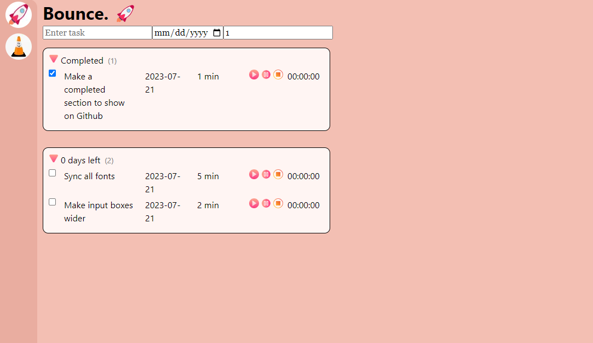

# bounce

  
Current version of [bounce](https://main.d2ngor7ea7fphp.amplifyapp.com/)

## Set up

Clone this repo with  
**Windows:** `git clone https://github.com/emilyy-liew/bounce.git <directory name>`  
**MacOS:** `git clone git@github.com:emilyy-liew/bounce.git <directory name>`

1. `npm install` to install project dependencies.
2. `npm install -g @aws-amplify/cli` to install Amplify CLI globally or `amplify -v` to check for any updates and `amplify upgrade` if so.
3. `amplify init` to initialize a new Amplify project.  
   **Enter a name for the environment:** `bounce`  
   **Choose your default editor:** `Visual Studio Code`  
   **Select the authentication method you want to use:** `AWS access keys`  
   **accessKeyId:** Provided by emily  
   **secretAccessKey:** Provided by emily  
   **region:** `eu-north-1`

4. `amplify configure` (?) and follow instructions to enter relevant information.
5. `amplify pull` to pull existing backend services.

## Running code locally

Run `npm run dev` and navigate to [http://localhost:3000](http://localhost:3000)
