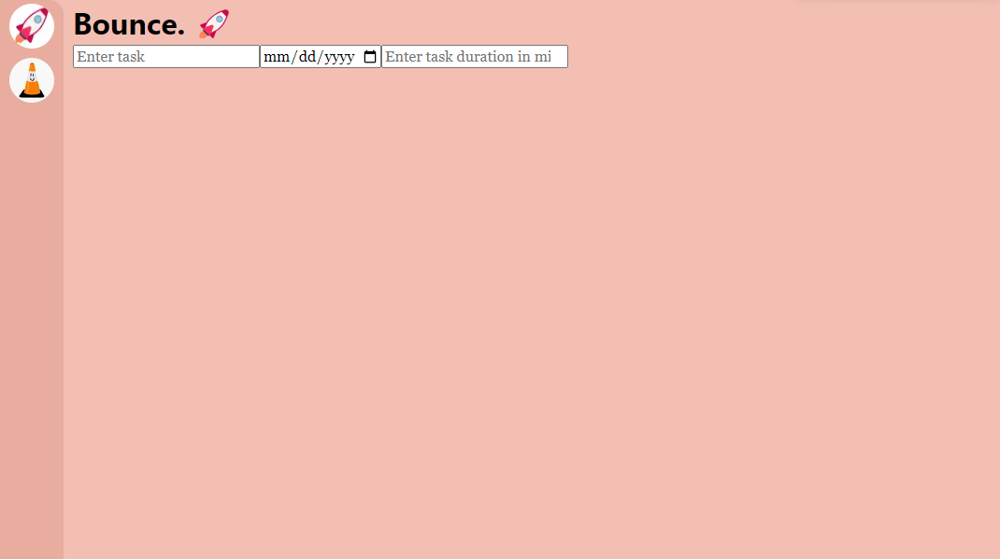

# bounce

  
Current version of [bounce](https://bounce-emilyy-liew.vercel.app/)

## Set up

Clone this repo with  
**Windows:** `git clone https://github.com/emilyy-liew/bounce.git <directory name>`  
**MacOS:** `git clone git@github.com:emilyy-liew/bounce.git <directory name>`

Run `npm install`

## Running code locally

Run `npm run dev` and navigate to [http://localhost:3000](http://localhost:3000)
